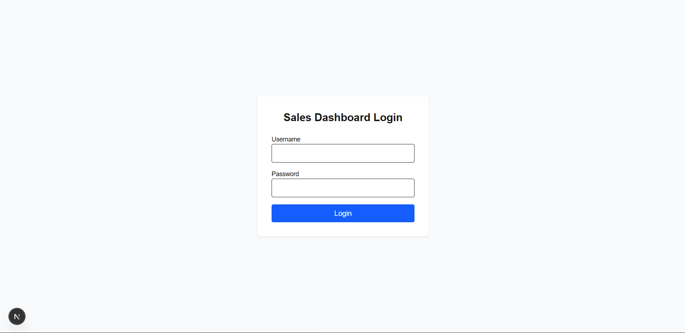
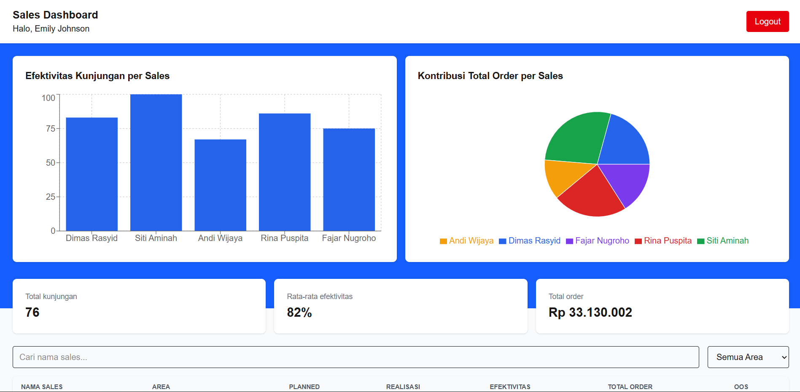

# Sales Dashboard — Technical Test Frontend Web

## Cara Menjalankan
1. Clone repository ini
2. Install dependency: `npm install`
3. Jalankan development server: `npm run dev`
4. Buka `http://localhost:3000` di browser

## Kredensial Login (DummyJSON)
Contoh akun untuk testing:
- Username: `emilys`
- Password: `emilyspass`

Kredensial lain bisa dilihat di `https://dummyjson.com/users`.

## Tech Stack
- Next.js (App Router) + TypeScript
- Tailwind CSS
- Recharts (visualisasi chart)
- React Context API (state management auth)

## Struktur Folder
src/
├── app/
│   ├── dashboard/
│   │   └── page.tsx            (halaman Dashboard)
│   ├── login/
│   │   └── page.tsx            (halaman Login)
│   ├── layout.tsx
│   └── page.tsx                (halaman root, redirect otomatis ke login jika user belum pernah login sebelumnya dan redirect ke dashboard jika sudah)
├── components/
│   ├── EffectivenessChart.tsx  (komponen chart, menggunakan recharts)
│   ├── Header.tsx
│   ├── LoginForm.tsx
│   ├── SalesTable.tsx          (komponen table daftar sales, dari mock dataset sales.json)
│   └── SummaryCard.tsx
├── context/
│   └── AuthContext.tsx         (AuthProvider, memiliki fungsi login dan logout)
├── data/
│   └── sales.json              (mock dataset dari soal)
├── lib/
│   ├── auth.ts                 (fungsi LoginUser, mengirim POST ke api)
│   └── salesUtils.ts           (menyimpan fungsi-fungsi pengolahan data; getTotalKunjungan, getRataRataEfektivitas, getTotalOrder, formatRupiah, dan filterSalesData)
└── types/
    └── index.ts                (interface: User, SalesData, dll)

## Keputusan Teknis & Justifikasi
- Kenapa pakai Context API, bukan Zustand/Redux?
    Karena scope aplikasi kecil yaitu hanya 1 jenis state (auth) dan tidak ada kebutuhan complex state logic yang butuh Redux/Zustand, jadi Context API digunakan. Keunggulannya untuk project ini adalah tidak perlu menambah dependency lagi.

- Kenapa data sales disimpan di file JSON statis lokal, bukan API?
    Sesuai instruksi soal, dataset performa sales ini memang spesifik untuk studi kasus dan tidak tersedia di API publik mana pun. Menyimpannya sebagai JSON statis lokal adalah pendekatan paling efisien untuk skala prototype ini — tidak perlu membangun/mengelola backend tambahan, sementara data tetap mudah diakses dan di-import langsung ke komponen dengan type safety dari TypeScript.

- Kenapa auth state disimpan juga di localStorage (bukan cuma di memory)?
    agar session login tetap survive jika di refresh.

- Kenapa pisah `lib/auth.ts`, `lib/salesUtils.ts` dari komponen?
    agar kode lebih terstruktur dan clean. sehingga fungsi-fungsi fungsional seperti filter data dan summary bisa digunakan ulang jika ada komponen baru yang dibuat namun memerlukan fungsi yang sama (separation of concerns)

## Asumsi
- Field `kunjungan_unplanned` disebutkan di deskripsi tabel soal, tapi tidak ada di contoh dataset JSON yang diberikan — sehingga field ini tidak diimplementasikan.

- Dropdown filter area dibuat otomatis dari data (menggunakan `Set` untuk mengambil nilai unik), bukan di-hardcode manual. Dengan begitu, jika ada penambahan area baru di dataset, dropdown akan otomatis menyesuaikan tanpa perlu mengubah kode.

- Chart efektivitas mengikuti filter area, tetapi mengabaikan filter pencarian nama. Tujuannya, chart ini dipakai untuk membandingkan performa antar sales dalam satu area (misalnya "siapa yang paling baik performanya di area Bandung"), bukan untuk melihat data satu orang tertentu — kebutuhan tersebut sudah terpenuhi lewat tabel dan fitur search-nya.

- Nilai order ditampilkan dalam format Rupiah tanpa desimal (misalnya `Rp33.130.002`), karena nilai transaksi dalam Rupiah pada praktiknya tidak memerlukan pecahan di bawah satuan rupiah, sehingga tampilan lebih ringkas dan mudah dibaca.

## Known Issues
- DummyJSON adalah API publik gratis yang memiliki rate limit. Saat rate limit tercapai (status 429), pengguna akan melihat pesan error yang jelas dan diminta mencoba lagi setelah beberapa saat. Ini di luar kendali aplikasi karena merupakan batasan dari pihak penyedia API.

- Saat rate limit DummyJSON tercapai, preflight request (`OPTIONS`) sering ikut terblokir oleh browser sebagai CORS error, sehingga request `POST` yang sesungguhnya tidak pernah terkirim. Akibatnya, aplikasi lebih sering menampilkan pesan "Gagal terhubung ke server" daripada "Terlalu banyak percobaan login" — meskipun akar masalahnya sama-sama rate limit. Ini adalah keterbatasan browser (kebijakan CORS) dalam membedakan jenis kegagalan request yang diblokir, bukan bug pada aplikasi. Pengecekan status 429 tetap dipertahankan di kode untuk menangani kasus di mana request berhasil terkirim namun responsnya sendiri berstatus 429

## Screenshot
### Halaman Login

### Halaman Dashboard
